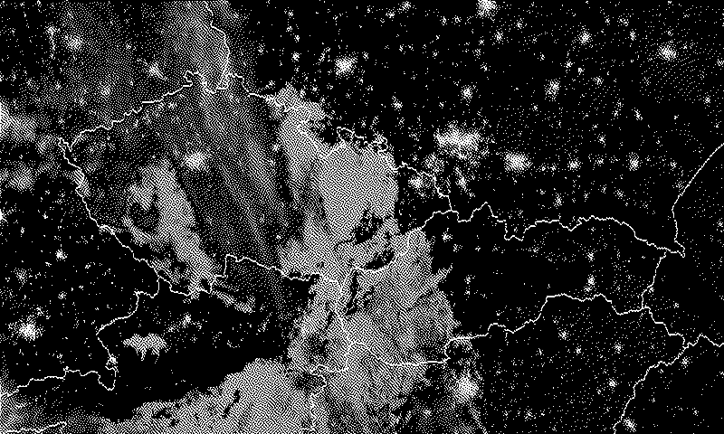

# Current state of the skies in black and white



```sh
./hack/generate_rgb_map.sh
pushd ditherer
cargo run -- ../eumetsat_mtg_geocolour_rgb_central_europe/eumetsat_rgb_central_europe_plus_boundaries_mercator.jpg ../eumetsat_mtg_geocolour_rgb_central_europe/eumetsat_rgb_central_europe_plus_boundaries_mercator_dithered.png
popd
podman build -t clouds_over_czechoslovakia .
```

# License

Boundary lines in this project are taken from <https://www.naturalearthdata.com> where they were kindly presented as public domain.

Satelite images are taken from [EUMETSAT](https://www.eumetsat.int/) [MTG GeoColour RGB](https://view.eumetsat.int/productviewer?v=mtg_fd:rgb_geocolour#), credits go to NASA.

All the code under this repository is distributed under the terms of the MIT license. See [LICENSE](LICENSE) for details.
